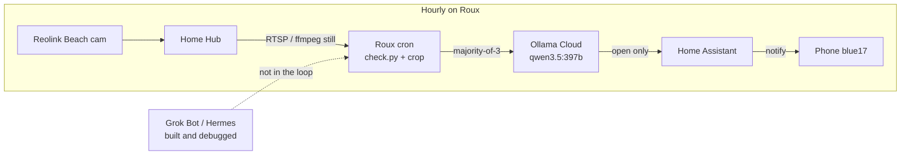

# Can a Yard Camera Tell If My Beach Gate Is Open?

I have a decorative wooden double gate that opens onto the beach at Finca Del Mar. Filigree cutouts that look like tree branches. Ocean through the pattern is normal. The gate itself ajar is not.

I wanted the house to notice the second case and ping my phone. Not a play-by-play of every false start. Just: can a Reolink still plus a vision model do this?

## The setup

Reolink Beach cam on the Home Hub. Duo-style 1536×432 stitch. No separate left/right lens stream to cheat with.

Hourly job on Roux:

1. Grab a still
2. Crop the gate ROI
3. Ask Ollama Cloud vision (`qwen3.5:397b-cloud`) three times, majority vote
4. Home Assistant notify `blue17` only if open

Silent on closed. Silent on unknown.

## Architecture

Grok built and debugged this. It is not in the hourly path.

## How it got built

I didn’t sit in a notebook and wire this by hand. My Home Assistant Grok Bot (Hermes) ran the experiment: still grabs, model A/B, prompt tweaks, the notify path.

The hourly job itself is a small Python script on Roux — also written by that bot, not Claude Code. I often prefer Claude Code on Roux for real code. This time Grok wrote it and it stuck. Live path: `/home/adam/code/beach-gate/check.py` (also in wrtflasher at `monitoring/beach-gate/`).

We could have left Grok on the loop: wake every hour, Tailscale in, pull a still, decide, ping me. That works. It’s also the wrong shape. I want a program that lives on the house server and runs without an outside agent hopping into the network every hour. Grok (and I) design and debug it. Cron owns the schedule (`48 * * * *`).

What’s still not fully local: the vision call. Locals on the 4090 missed night ajar. Cloud `qwen3.5:397b` didn’t. So the job is local; the VLM is cloud until a local model can see that gap in the dark.

## What actually worked

Small local vision models — including the qwen3-vl flavors I tried on the house GPU — were fine on daytime closed. They missed night ajar even with a tight crop.

Cloud 397b was the only one that reliably saw night ajar in A/B. That decided the stack.

Cropping helped. An over-eager “any dark gap = open” prompt did not. On closed night stills the spotlight turns the center seam and the filigree shadows into fake gaps. The prompt had to learn: thin seam is closed. A real parting between the frames is open.

OSD (timestamp + “Beach”) was burned into the Hub stream. Turned it off. Cleaner input for the model.

HA `camera_proxy` was convenient until it wasn’t. 404s on HA reboot, and it doesn’t wake the cam spotlight. Cron grab switched to Hub RTSP through ffmpeg so night grabs actually light the scene.

Yard lights off and no spotlight → too dark → unknown. Spotlight mode → classifiable.

Closed vs ajar at night, same crop, same spotlight:

*Closed*

*Ajar*

## Still cooking

This has been running a few days. Jury’s out on false positives over a longer window. I may also stick an IKEA MYGGBETT door/window sensor (Matter over Thread, not Zigbee) on the ocean side of the gate and see how long salt air lets it live.

Camera + VLM is the interesting part. The contact sensor would be the boring backup that either confirms it or makes the whole vision stack look silly.
